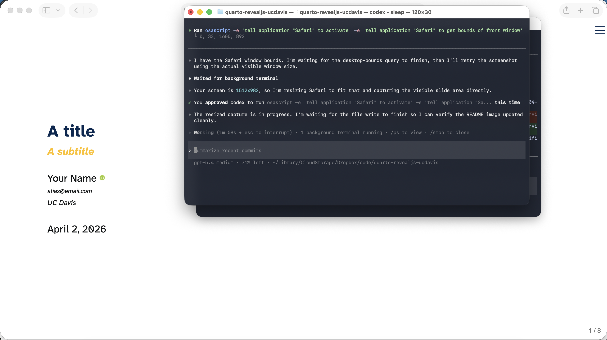

# Quarto UC Davis theme

A UC Davis-branded presentation theme for Quarto Reveal.js. Uses **Fira Sans Condensed** for text, **Source Code Pro** for code, and the official UC Davis color palette (Aggie Blue and Aggie Gold).



## Use

Depending on your use case, here are some [Quarto CLI](https://quarto.org/)
commands to get started.

If you would like to add the **ucdavis** theme to an existing directory:

```bash
quarto install extension hail2thief/quarto-revealjs-ucdavis
```

Alternatively, you can use a
[Quarto template](https://quarto.org/docs/extensions/starter-templates.html)
that bundles the **ucdavis** theme plus a .qmd starter document:

```bash
quarto use template hail2thief/quarto-revealjs-ucdavis
```

Then, in your document YAML header:

```yaml
format: ucdavis-revealjs
```

## Colors

The theme uses the official UC Davis brand colors:

| Color | Hex | Usage |
|---|---|---|
| Aggie Blue | `#022851` | Headings, links, buttons |
| Aggie Gold (muted) | `#B3A369` | Subtitles, alerts |
| Aggie Gold (bright) | `#FFBF00` | Available as `$ucdavis-gold` |

## Acknowledgments

Based on the [clean](https://github.com/grantmcdermott/quarto-revealjs-clean) theme by [Grant McDermott](https://grantmcdermott.com/), which was inspired by Kyle Butts' [LaTeX template](https://raw.githack.com/kylebutts/templates/master/latex-slides/slides.pdf).
