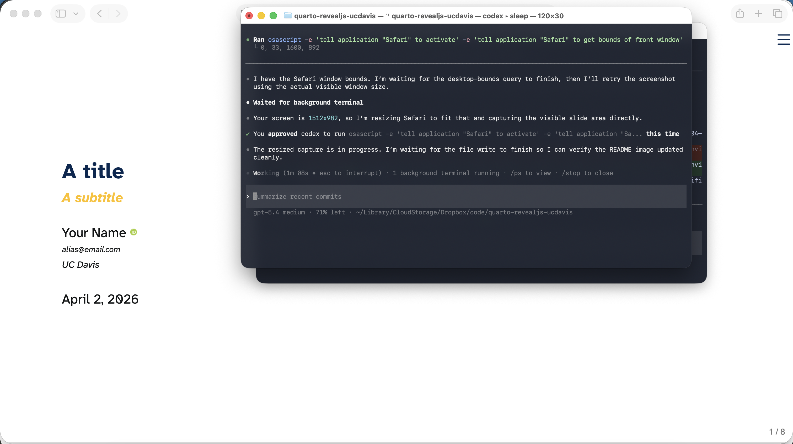

# Quarto UC Davis slide starter

A UC Davis-branded Quarto Reveal.js starter project built around `_brand.yml`. It uses **Atkinson Hyperlegible Next** for text, **Source Code Pro** for code, and the official UC Davis color palette on a white background.

[](https://hail2thief.github.io/quarto-revealjs-ucdavis/slides.html)

The screenshot above links to the live example deck. Enable GitHub Pages for the repo's `docs/` folder and GitHub will publish `docs/slides.html` at that URL.

## Use

Clone this repo, then start editing `slides.qmd`.

```bash
git clone <repo-url>
cd quarto-revealjs-ucdavis
quarto preview slides.qmd
```

To regenerate the published preview:

```bash
quarto render slides.qmd
```

The project structure is intentionally simple:

- `_brand.yml` defines the shared UC Davis colors and typography.
- `_quarto.yml` sets Reveal.js defaults for the whole project.
- `custom.scss` adds Reveal-specific layout and utility styles.
- `slides.qmd` is the starter deck you can rewrite for a new talk.
- `docs/` contains the rendered example deck for GitHub Pages-style previews.

This is a better fit than a full format extension if your main use case is:

- cloning a slide repo and starting from a good branded default
- keeping branding portable across projects
- separating brand tokens from Reveal.js-specific tweaks

## Inverse Slides

Use Reveal's slide background attribute together with the `.inverse` class:

```markdown
## Section Break {.inverse background-color="#022851"}
```

That pattern is more reliable than trying to force a full-slide dark background with CSS alone.

## Colors

The theme uses the official UC Davis brand colors:

| Color | Hex | Usage |
|---|---|---|
| Aggie Blue | `#022851` | Title, links, buttons |
| Aggie Blue (soft) | `#1B4F72` | h4, list markers |
| Aggie Gold | `#FFBF00` | Subtitles, h3, alerts |
| White | `#FFFFFF` | Slide background |

## Acknowledgments

The Reveal.js styling in `custom.scss` is based on ideas from the [clean](https://github.com/grantmcdermott/quarto-revealjs-clean) theme by [Grant McDermott](https://grantmcdermott.com/), which was inspired by Kyle Butts' [LaTeX template](https://raw.githack.com/kylebutts/templates/master/latex-slides/slides.pdf).
